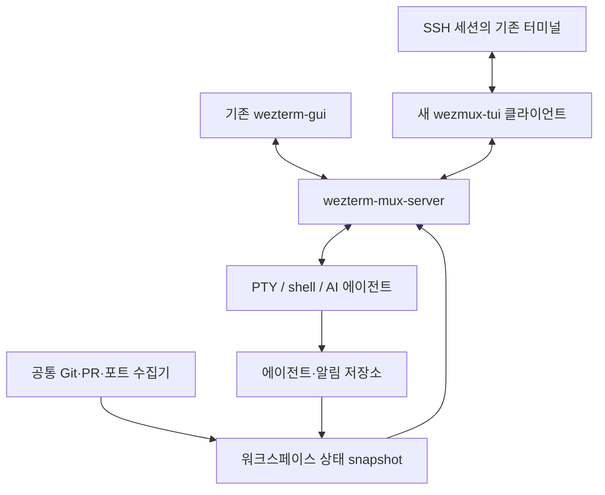

# Wezmux TUI 구현 계획

## 1. 목표와 현재 상태

목표는 GUI가 없는 Ubuntu SSH 세션에서 현재 터미널 안에 워크스페이스,
분할 패널, 에이전트 상태를 표시하고 detach/attach할 수 있는 Wezmux이다.
`DISPLAY`, Wayland, X 서버, GPU를 실행 전제 조건으로 삼지 않는다.

이 문서는 구현 계획이다. **TUI 클라이언트는 아직 구현되지 않았다.**
현재 Linux 변경 사항은 기존 GUI의 설치·메뉴·hook·기본 설정·CI 개선이며,
이를 적용해도 `wezterm-gui`가 SSH TUI로 바뀌지는 않는다.

### 완료된 기반 작업

- `make install`의 macOS/Linux 분기와 사용자 전용 Linux 설치 구조.
- Linux용 기본 폰트와 키 설정, 기존 설정을 가리지 않는 초기 설정 생성.
- 설치본·개발본 wrapper 탐색과 Claude/Codex hook 명령의 경로 quoting.
- Unix 패널의 PTY 경로를 `WEZMUX_TTY`로 전달.
- Linux GUI의 GPU 기반 워크스페이스 메뉴.
- GitHub PR·포트 조회 subprocess의 제한 시간.
- Ubuntu 빌드/테스트/설치 검증 CI.

### 코드에서 확인한 재사용 지점

| 영역 | 현재 위치 | 활용 방법 |
| --- | --- | --- |
| 서버·PTY | `wezterm-mux-server`, `mux/src/domain.rs` | shell과 에이전트를 클라이언트 수명과 분리 |
| 클라이언트 | `wezterm-client/src/client.rs`, `domain.rs` | Unix socket 연결과 기존 RPC 재사용 |
| 화면 프로토콜 | `codec/src/lib.rs` | `GetPaneRenderChanges`, `GetLines`, 커서·크기·seqno |
| 입력·크기 | `codec/src/lib.rs` | `SendKeyDown`, `SendMouseEvent`, `Resize` |
| 터미널 출력 | `termwiz/src/terminal`, `surface` | raw mode, alternate screen, 입력 파싱, 차등 출력 |
| 상태 전달 | `NotifyAlert`, `Alert::WezmuxStatus` | 연결 중 발생하는 에이전트 이벤트 재사용 |
| 상태 저장소 | `mux/src/agent_status.rs`, `notification.rs` | GUI/TUI 공통 상태 모델 |
| 메타데이터 | `wezterm-gui/src/termwindow/sidebar.rs` | GUI 의존성을 제거한 공통 수집기로 이동 |

`wezterm cli proxy`는 바이너리 프로토콜을 중계하는 코드이지 사람이 쓰는
attach 화면이 아니다. 기존 GUI overlay도 `window::Window`에 의존하므로
TUI 프런트엔드로 그대로 사용할 수 없다.

## 2. 범위

### 첫 릴리스에 포함

- 같은 Ubuntu 호스트의 Unix socket 서버 연결 및 필요 시 서버 시작.
- 단일 패널, workspace/tab 전환, 수평·수직 분할, 패널 포커스.
- shell, vim, Claude/Codex 등 전체 화면·대화형 프로그램.
- prefix 기반 명령, detach/attach, resize, 스크롤백 탐색.
- 문자 기반 사이드바: 이름, git branch/dirty, PR, 포트, 에이전트 상태,
  입력 대기, unread 표시.
- 서버가 살아 있는 동안 SSH 연결이 끊겨도 작업 프로세스 유지.

### 첫 릴리스에서 제외

- WezTerm GUI의 픽셀 단위 외형·blur·알림 링·native 메뉴 재현.
- 이미지 프로토콜, 임의의 그래픽 콘텐츠, 외부 터미널의 모든 확장 기능.
- GUI와 TUI가 같은 패널을 동시에 조작하는 완전한 다중 사용자 협업.
- 모든 플랫폼 이식, SSH/TLS 연결 설정 UI, 자동 에이전트 재실행.
- 서버 재시작 시 살아 있던 프로세스를 복구한다는 보장.

## 3. 권장 아키텍처

새 Cargo package는 **제안 이름** `wezterm-tui`, 실행 파일은 `wezmux-tui`로
한다. 기존 `wezmux` GUI 실행 명령은 유지한다. 추후 UX가 검증된 뒤에만
`wezmux attach` 등 통합 명령을 검토한다.

공통 모델/수집기는 **제안 이름** `wezmux-core`로 분리하거나 기존 `mux`에
배치한다. P0에서 의존성 방향을 확인해 결정한다. 어느 경우에도
`wezterm-gui`, `window`, 폰트 shaping 엔진을 headless 경로에 끌어들이지 않는다.
`TermWindow`, GPU `Element`/`ComputedElement`는 GUI 안에 남긴다.

초기 TUI는 이미 SSH로 들어온 호스트 안에서 서버와 통신한다. 별도의
클라이언트 SSH 연결·인증 구현은 필요하지 않다.

## 4. 단계별 구현과 완료 조건

### P0 — headless 경계와 작은 기술 검증

작업:

1. `cargo metadata`의 실제 dependency graph로 서버/TUI에 그래픽 의존성이
   들어오지 않는지 확인한다. GUI용 Lua API 등록도 분리한다.
2. `Client::new_unix_domain`과 headless `ConnectionUI`로 최소 연결을 검증한다.
3. 기존 클라이언트의 unsolicited PDU 처리와 `ClientDomain` 등록 요건을 확인한다.
   기존 경로를 재사용할지 TUI 전용 subscriber를 추가할지 결정한다.
4. `termwiz` 출력·키 입력·창 크기 변경을 실제 SSH PTY에서 실행한다.
5. 화면 line hydration, palette, seqno 처리를 조사해 ASCII 단일 패널을 그린다.

완료 조건:

- `DISPLAY`/`WAYLAND_DISPLAY`가 없는 세션에서 서버 연결과 화면 출력 성공.
- shell 입력/출력과 terminal restore를 직접 검증.
- dependency graph와 부족한 API를 문서화하고 P1 인터페이스 확정.

**중단 기준:** 입력 또는 화면 동기화의 기존 API를 안전하게 재사용할 수
없다면 이유와 대안을 먼저 기록한다. 이 검증 전 전체 sidebar를 구현하지 않는다.

### P1 — 단일 패널 attach/detach MVP

작업:

- Unix socket 선택, 서버 auto-start/연결 실패/버전 불일치 안내.
- raw mode와 alternate screen의 수명 관리, 로그는 화면과 분리.
- 전체 화면 최초 동기화 후 dirty line 기반 출력.
- 입력을 활성 pane으로 전달하고 paste와 키 입력을 구분.
- outer terminal resize → pane resize → 전체 재그리기.
- 기본 prefix는 Ctrl+B를 제안하되 기존 tmux 중첩 사용을 위해 변경 가능하게 한다.
- prefix 뒤 `d`는 detach, prefix 두 번은 실제 Ctrl+B 전달.
- SSH 종료·정상 detach가 shell을 종료시키지 않도록 server/client 수명 분리.

완료 조건:

- shell에서 명령 실행, vim 편집·저장·종료, 에이전트 대화 실행 성공.
- detach 후 재접속 시 동일 pane/process와 최신 화면 유지.
- 정상 종료·서버 오류 후 echo/canonical mode와 커서 상태가 복구됨.
- 외부 SIGKILL은 Drop으로 복구할 수 없음을 문서화하고 `reset` 복구법 안내.

### P2 — 워크스페이스와 분할 레이아웃

작업:

- 서버 `PaneNode`를 문자 셀 좌표의 레이아웃으로 변환.
- border·sidebar·status line 크기를 제외한 pane 크기를 서버에 전달.
- pane/tab/workspace 생성·전환·닫기, 포커스와 split resize 연결.
- 명령 메뉴, 도움말, 닫기 확인을 TUI 방식으로 제공.
- 작은 화면에서는 sidebar를 숨기고 최소 pane 크기 유지.
- mouse 지원은 선택 기능으로 두고 프로그램의 mouse reporting과 UI 입력 분리.
- scrollback/copy mode에서는 서버 입력 전송을 중지하고 로컬 선택 처리.

완료 조건:

- 두 workspace, 각 workspace의 split에서 동시에 작업 가능.
- 입력·resize가 다른 pane에 전달되지 않음.
- 좁은 터미널과 resize 반복에서도 border/cursor가 잘못된 위치에 남지 않음.

### P3 — 공통 에이전트 상태와 메타데이터

작업:

- GUI에서 agent/process/git/PR/port 수집을 공통 계층으로 추출.
- 수집은 pane이 존재하는 서버 호스트에서 수행한다. TUI가 접속한
  클라이언트 호스트의 프로세스·포트를 잘못 조사하지 않도록 한다.
- 서버 시작 경로에 `WEZMUX=1`, wrapper 탐색/PATH 연결을 추가.
- GUI/TUI 모두 같은 상태 snapshot과 generation을 사용.
- Git 공유 조회·비용 기반 throttling·포트 캐시·PR 조회 간격 유지.
- GUI와 TUI가 동시에 붙어도 수집 작업을 중복 생성하지 않음.
- `NotifyAlert` 실시간 이벤트에 더해 접속 시 전체 상태 snapshot API 추가.
- unread는 현재 표시/포커스 상태를 서버에 보고하여 갱신한다.

완료 조건:

- Claude/Codex의 working/idle/needs_input이 올바른 workspace에 표시됨.
- 클라이언트가 없을 때 발생한 상태·알림도 attach 후 즉시 보임.
- `gh`, `lsof` 부재·오류·지연이 입력과 화면 갱신을 막지 않음.
- 큰 저장소의 지속 출력 상황에서 metadata scan이 무제한 반복되지 않음.

### P4 — 재접속, 호환성, 배포

작업:

- 서버 연결 손실 시 bounded backoff, 입력 중복 재전송 방지, 전체 resync.
- 여러 클라이언트는 초기에는 pane당 한 개의 interactive size owner를 둔다.
  새 소유자 전환 시 resize하고 다른 viewer의 화면 정책을 명시한다.
- 서버 살아 있음과 서버 재시작을 구분한다. 후자는 저장한 layout/CWD/scrollback
  복원만 보장하고 이전 PID·실행 중 명령 복구를 약속하지 않는다.
- GUI/TUI 설정을 분리하고 `termwiz` capability probing/terminfo에 따른 색상 fallback.
- `make install-tui`를 추가하여 GUI를 빌드하지 않고 서버/TUI만 설치 가능하게 한다.
- 서버 전용 경로에도 hook resources 포함, 설치 대상별 dependency 안내.
- Ubuntu PTY 통합 CI, SSH 실기 검증, GUI 회귀 검증을 수행한다.

완료 조건:

- GUI 패키지 없이 headless build/install/attach 성공.
- SSH 연결 종료 후 재접속 시 프로세스 유지 및 최신 화면 복원.
- 기존 GUI 사용자의 설정·native 메뉴·서버 연결 방식에 회귀 없음.

## 5. 상태·프로토콜 계약

기존 pane 화면 RPC와 `NotifyAlert`를 먼저 재사용한다. 새 RPC 이름은
P0 검증 뒤 확정하며, 아래는 **새로 필요한 계약**이다.

- 전체 workspace snapshot: workspace/window/tab/pane 식별자, agent 상태,
  preview, task counts, unread, metadata, generation.
- snapshot 이후 변경 이벤트: generation과 식별자로 순서를 확인하고
  누락/재접속 시 snapshot 재요청.
- focus/visibility 보고와 unread ack: 서버에서 membership 검증 후 반영.
- 클라이언트 capability와 size ownership: attach할 때 명시적으로 협의.
- 오래된 client/server 조합은 기능 협의 또는 이해 가능한 버전 오류로 처리.

wire type은 `Instant`나 로컬 프로세스 객체 대신 직렬화 가능한 값으로
정의한다. 표시할 수 없는 pane에 대한 alert도 초기 snapshot에서 누락하지 않는다.
알림 history와 client별 unread의 의미는 P3 전에 결정한다. 초기에는
서버 공통 unread로 시작하고, 클라이언트별 unread는 후속 기능으로 둔다.

## 6. 렌더링·입력 원칙

- 원시 PTY 바이트를 outer terminal에 그대로 passthrough하지 않는다.
  서버가 파싱한 cells/attributes를 TUI layout에 합성한다.
- Unicode grapheme, CJK 너비, combining mark, wide-cell continuation 처리.
- pane cursor를 layout 좌표로 변환하고 copy mode/menu 표시 중 커서를 제어.
- palette 변경·alternate screen·전체 clear는 전체 redraw 조건으로 처리.
- terminal capability에 맞춰 truecolor/256/기본 색상으로 낮춘다.
- 출력 burst는 bounded frame queue로 합치되 키 입력과 resize를 우선 처리.
- OSC clipboard/link/title 등 outer terminal side effect는 명시적 정책을 둔다.
  sidebar metadata의 제어 문자는 기존 sanitize 원칙을 유지한다.
- GUI 단축키를 그대로 복사하지 않고 prefix 기반 명령으로 재설계한다.

## 7. 테스트 계획

| 종류 | 주요 검증 |
| --- | --- |
| Unit | layout 계산, pane 좌표 변환, Unicode 폭, prefix/paste 구분, snapshot ordering |
| 서버/client 통합 | spawn/split/resize/key RPC, alert, focus/unread, 버전 오류 |
| PTY 통합 | raw mode 복구, SIGWINCH, detach/attach, 서버 EOF, slow output, paste |
| 실제 앱 | shell, vim, Claude/Codex, Unicode 출력, alternate screen, mouse mode |
| 회귀 | 기존 mux tests, GUI sidebar/cache tests, Linux install/hook tests |
| 성능 | 다중 pane의 고속 출력, 느린 SSH, 큰 저장소, stalled gh/lsof |

테스트는 synthetic 화면뿐 아니라 실제 프로그램을 PTY에 실행한다.
각 단계에서 실패하는 행동 테스트를 먼저 추가하고 수정 후 통과를 확인한다.
PTY CI가 통과해도 실제 SSH terminal emulator 조합 검증을 대체하지 않는다.

## 8. 권장 커밋 단위

1. `feat(tui): bootstrap headless client and terminal lifecycle`
2. `feat(tui): render and interact with a single remote pane`
3. `feat(tui): support detach, reattach and resize recovery`
4. `feat(tui): add workspace and split-pane navigation`
5. `refactor(wezmux): share workspace metadata collection`
6. `feat(mux): expose workspace snapshots and notification acknowledgements`
7. `feat(tui): display agent status and workspace metadata`
8. `feat(tui): add scrollback, copy mode and optional mouse interaction`
9. `feat(linux): install headless client without GUI dependencies`
10. `test(tui): exercise SSH/PTY reconnect and compatibility scenarios`

각 커밋은 빌드 가능한 경계를 유지한다. GUI 코드 분리와 프로토콜 추가는
동작을 유지하는 별도 커밋으로 만들고, TUI 기능과 무관한 리팩터링은 제외한다.

## 9. 최종 수용 기준

사용자가 SSH 접속 후 설치된 `wezmux-tui`로 shell/에이전트를 실행하고,
여러 workspace와 split을 탐색하며, 입력 대기를 sidebar에서 확인할 수 있다.
detach 또는 SSH 종료 후에도 서버의 작업은 계속되고 재접속하면 동일
작업으로 돌아온다. 이 전체 흐름에서 GUI 디스플레이나 GPU가 필요하지 않는다.

P0/P1 결과 전에는 개발 기간이나 tmux 수준의 완전한 호환성을 보장하지 않는다.
현재 작업은 이 문서와 Linux GUI 대응 변경까지이며, 향후 TUI 구현은 별도 작업이다.
